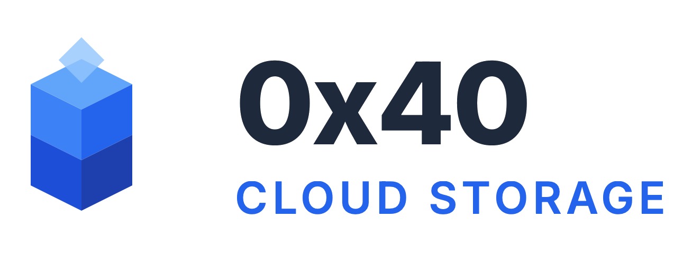

<div align="center">
  
  <p>Secure, private, and personal cloud storage solution.</p>
</div>

<div align="center">

[](https://go.dev/)
[](https://reactjs.org/)
[](https://www.typescriptlang.org/)
[](https://www.docker.com/)
[](https://nginx.org/)

</div>

---

> [!IMPORTANT]
> This project is only for personal usage, please do not use it for illegal purposes, and please do not use it in a production environment.

## Quick Start
To instantly set up and run the 0x40 Cloud environment, use the following command:

```bash
bash <(curl -Ls https://raw.githubusercontent.com/Dreamer0iQ/0x40-cloud/refs/heads/main/install.sh)
```

## Architecture

The system is built with security and modularity in mind, ensuring a robust personal cloud experience.

*   **[Backend](backend)**: Powered by Go, ensuring high-performance data handling and secure API endpoints.
*   **[Frontend](frontend)**: A modern, responsive interface built with React and TypeScript for a seamless user experience.
*   **[Security Audit](security_audit)**: Comprehensive Python tools and scripts to continuously monitor and validate system resilience.
*   **[Nginx](nginx)**: Acts as the secure gateway, managing reverse proxy duties and traffic routing.
