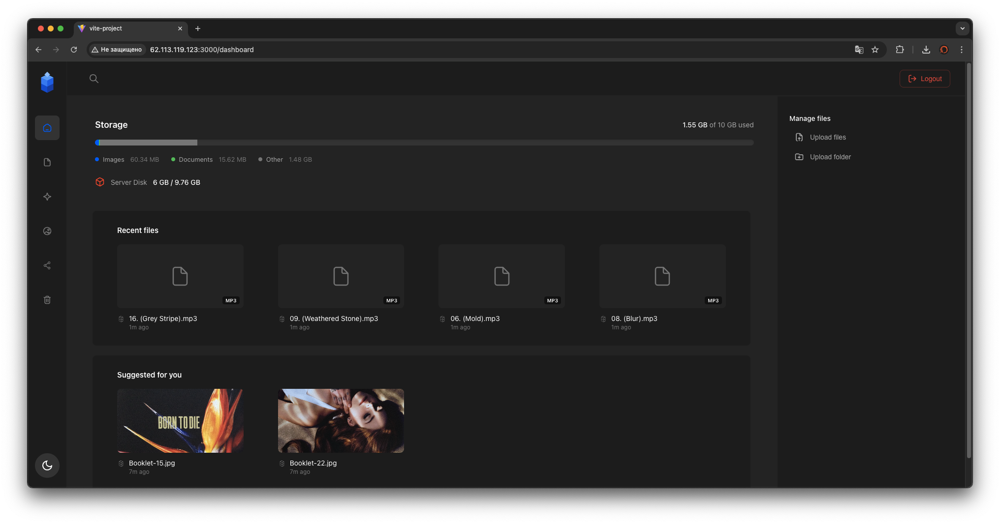

<div align="center">
  
  <p>Secure, private, and personal cloud storage solution.</p>
</div>

<div align="center">

[](https://go.dev/)
[](https://reactjs.org/)
[](https://www.typescriptlang.org/)
[](https://www.docker.com/)
[](https://nginx.org/)

</div>

---

> [!IMPORTANT]
> This project is only for personal usage and please do not use it in a production environment.

## Quick Start
To instantly set up and run the 0x40 Cloud environment, use the following command:

```bash
bash <(curl -Ls https://raw.githubusercontent.com/Dreamer0iQ/0x40-cloud/refs/heads/main/install.sh)
```

## Security & Encryption

0x40 Cloud prioritizes your data security with enterprise-grade encryption:

*   **AES-256-GCM Encryption**: All uploaded files are encrypted at rest using AES-256-GCM (Galois/Counter Mode), providing both confidentiality and authenticity.
*   **Content-Addressed Storage**: Files are stored using SHA-256 hash-based deduplication, ensuring efficient storage while maintaining data integrity.
*   **Secure Authentication**: JWT-based authentication with configurable expiration and HTTPS-only secure cookies.
*   **Automatic Key Generation**: When using the Quick Start installer, cryptographically secure secrets are automatically generated:
    *   **JWT Secret**: 32-byte random token using `openssl rand -base64 32` for session authentication
    *   **Encryption Key**: 32-byte hexadecimal key using `openssl rand -hex 16` for AES-256-GCM file encryption
    *   All secrets are safely stored in `.env` file with masked display for security
*   **Path Traversal Protection**: Sanitized file paths prevent directory traversal attacks.
*   **Non-root Containers**: All Docker containers run as unprivileged users (UID 1000) to minimize container escape risks.

For detailed security information, see [SECURITY.md](SECURITY.md).

## Interface

<div align="center">
  
  <p><em>Modern, intuitive dashboard for managing your files</em></p>
</div>

## Architecture

The system is built with security and modularity in mind, ensuring a robust personal cloud experience.

*   **[Backend](backend)**: Powered by Go, ensuring high-performance data handling and secure API endpoints with AES-256-GCM encryption.
*   **[Frontend](frontend)**: A modern, responsive interface built with React and TypeScript for a seamless user experience.
*   **[PostgreSQL](https://www.postgresql.org/)**: Robust relational database for metadata and user management.
*   **[Redis](https://redis.io/)**: High-performance caching layer for session management and frequently accessed data.
*   **[Nginx](nginx)**: Acts as the secure gateway, managing reverse proxy duties, SSL/TLS termination, and traffic routing.
